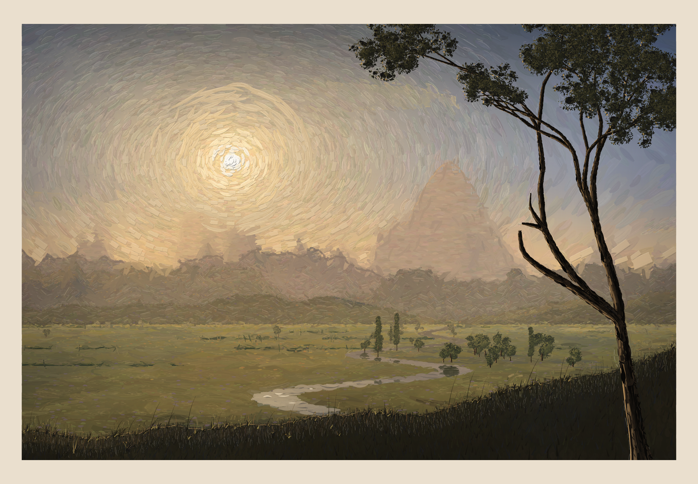
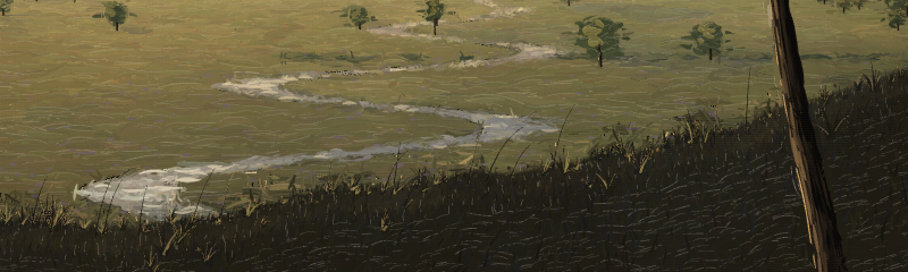
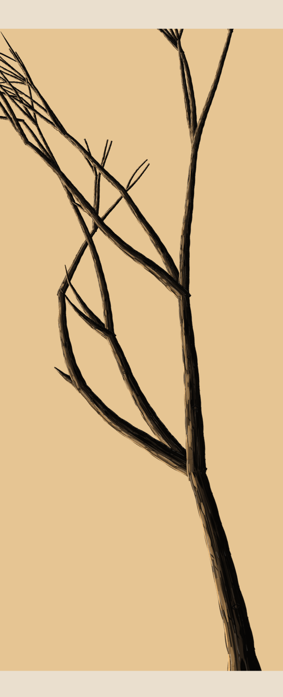
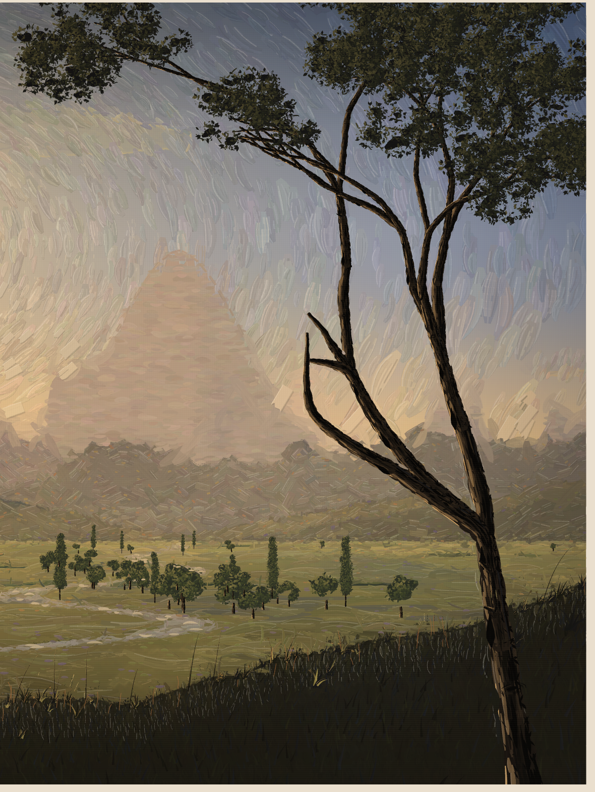
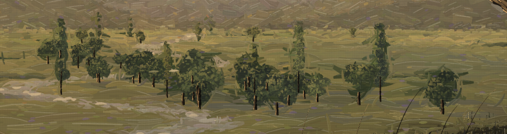
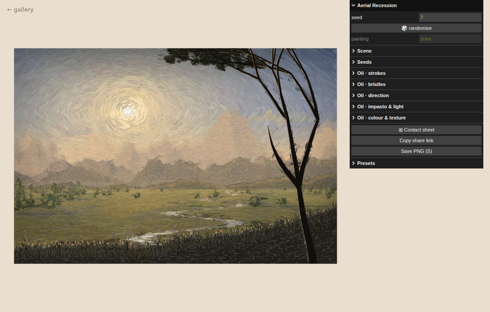

# 036 — Aerial Recession

**Mechanism (one sentence):** one camera over one ground plane, one low sun, and one
transmittance term `1 − e^(−k·z)` decide the size, colour, contrast, detail and edge of
every mark, so the classical rules of landscape depth are computed rather than painted.

Original composition, painted with [p5.brush](https://github.com/acamposuribe/p5.brush)
(2.2.3, p5 2.x WEBGL). Not a copy of any painting. Two media: **oil** (default) and
**watercolour** — the same scene, the same seed, painted two ways.

Watercolour version (`p_medium=0`): [`preview-watercolour.png`](preview-watercolour.png).

## Philosophy — *Aerial Recession*

A landscape painting is a flat surface pretending to be miles deep. The masters did not
draw that depth; they obeyed a handful of optical laws so consistently that the eye could
not refuse them. This piece takes those laws literally. Nothing is placed "far away" by
taste: it is given a depth `z`, and depth alone decides how large it is, how much air
stands between it and the viewer, how many octaves of detail survive that air, and
whether its edge is drawn or dissolved.

**Space.** A pinhole camera stands one unit above a ground plane, its horizon on the lower
third. Fields, hedgerows, trees, the river and the cloud ceiling are all world objects
projected through it (`y = HY + F/z`, `x = CX + F·x/z`), so they shrink and converge
without being told to. The river is a straight world line whose projection is solved to
vanish exactly on the focal third, plus a sinusoid in `log z` that perspective compresses
into tightening S-curves — a leading line from the bottom edge into the distance. Clouds
on a ceiling above the camera grow smaller, flatter and lower as they recede.

**Air.** Every colour is `mix(local, haze, 1 − e^(−k·z))`. The haze itself is warmer and
brighter toward the sun. The same term reduces contrast between lit and shadowed faces,
lowers the number of noise octaves in a ridgeline (far ranges are smooth, near ones are
broken), thins slope strokes, and decides edgework: ranges beyond ~55 % haze are wash
only (lost edges); nearer ridges are inked, and even then the ink breaks wherever a noise
field says mist is lying on the crest (lost-and-found). Mist pools in each valley floor
as a bleeding watercolour band.

**Light.** One sun, on the vertical third opposite the focal point, low in the sky. Each
summit with real prominence is split about a jittered spur into a lit face and a cool
shadow face on the side away from the sun; a warm glaze rides the sunward ridges. Trees
cast long shadows away from the light — the lower the sun, the longer — and cloud
shadows dapple the plain, flattened by the same ground-plane projection. The water mirrors
the sky at the reflected angle and carries a glitter path under the sun. The dark
foreground silhouette catches a thin warm rim only on edges facing the light.

**Frame.** A repoussoir — a dark bank rising toward the shadow side and a tree at that
edge whose limbs arch over the top of the picture —
pushes the lit middle distance back. The tree grows recursively, but around a keep-clear
zone (the sun, the focal third, the middle distance): a limb heading into it bends up and
back toward the edge, and stops only if it cannot. The dominant peak and the river's
vanishing point share the focal third; the sun holds the other; the horizon holds the
lower third line.

**Mood.** A limited palette per mood sets temperature and therefore emotion: *golden
hour* (warm nostalgia), *after the storm* (slate with a gold break, heavier cloud, stronger
rays), *dawn mist* (cool, pale, low contrast). The painting assembles itself back to front
over several seconds — sky, far ranges, mist, nearer ranges, fields, river, trees,
repoussoir, paper — the order a painter would work in.

## Oil — the same scene, repainted

The oil medium paints the scene the way a tonalist works from an underpainting. The
whole watercolour pipeline runs first and is read back into memory; then the surface is
repainted in opaque, bristle-streaked strokes. Nothing about the scene changes — the seed
builds identical geometry — only the paint. Colour comes from the underpainting under
each stroke; every other decision is read from the scene's geometry.

| principle | how the oil engine does it |
|---|---|
| **Directional rhythm — sky** | every sky stroke follows a (slightly flattened) circle centred exactly on the sun, lengthening outward: a vortex that winds the eye to the light |
| **— mountains** | near ranges in short, straight, square-ended facets in three directions (fall line, a crossing facet, the crest), chosen per stroke — craggy geology rather than gradients |
| **— field** | long, sweeping, nearly level strokes (3× longer than elsewhere) — the stable base under the moving sky; their size ∝ `1/√z` and density ∝ `1/size²`, so the brushwork itself recedes |
| **Impasto hierarchy** | each stroke carries a relief value, drawn as a ridge of paint under a fixed *room* light from the upper left: a shadow strip on the far side, a specular edge on the near side. The sun's core is the thickest paint (relief 1.0), its halo steps down ring by ring (0.85 → 0.22), the foreground tree is high (0.5–0.6), the rest low (0.1–0.25), the far ranges flat |
| **Lost edges** | far ranges are painted in soft, level strokes and get no edge pass; a wet-on-wet blend band of strokes straddling each far crest, loaded with the sky above and the mountain below, melts them into the haze |
| **Found edges** | the framing tree is redrawn last as a hard near-black silhouette with a thin warm rim on the sun side |
| **Grass** (`oilGrass`) | built the way a painter builds it, not as a row of stalks. *Turf*: thousands of short upright flicks over the bank, densest at the lip, each a few percent off the local value and temperature (cool, olive, neutral dark), larger lower down where the bank is nearer. *Tufts*: placed at irregular steps along the lip, with bare stretches where noise says nothing grows, and rooted at different depths so they overlap rather than stand on one line. Each tuft is a dark base mass, then 4–13 blades fanned from one root, tapered from root to point, arcing progressively with a shared wind field, of log-normal length. *Contre-jour*: blades are dark silhouettes against the lit field; a few toward the sun are lit through (yellow-green), and some sunward edges carry a thin warm rim. *Seed heads* on about a third of tufts only, as small grains along a nodding tip, kept close to the stem's value. Below the lip the bank's own oil strokes are short and upright like the turf, matte (no ridge highlight, which on a dark ground reads as grey streaks), and their bristles carry the stroke's own colour. Panel: *grass density (oil)*. |
| **Broken colour** | 2,600 sparse micro-strokes of violet (in shadows), olive (mid-tones), ochre and dull orange (lights), each only half-mixed with the paint beneath, laid unblended into the field and mountains |
| **Scumbling** | dry-brush passes — bristles only, lighter opaque paint, broken often — dragged over the plain (more toward the distance) and through the sun's halo, leaving the darker layer showing |
| **Value: glow vs gloom** | the sun's core goes to near-white; the halo is five discrete tonal rings stepping down to the sky, painted outside-in so each brighter ring sits on the one outside it; the silhouette is pushed 40 % toward black so the meadow reads luminous against it |
| **Canvas** | a fine twill of light and dark threads over everything |

Each stroke is two colours loaded on one brush — the paint under its middle and under its
far end — and its bristles streak a mix of the two, starting late, breaking where the
brush runs dry, lifting early.

Why the oil strokes are native rather than p5.brush strokes: p5.brush mixes colour
spectrally (Kubelka–Munk, via spectral.js), which is the right optics for transparent
watercolour glazes — the underpainting uses it throughout — but it darkens with every
overlap (measured: a sky sampled at `[118,123,133]` came back `[82,84,86]` after the
layers built up). Oil body paint is opaque, so the strokes are drawn with ordinary "over"
blending.

## The trees — a trunk model, painted in oil

The trunks are built on a model decomposed from a drawing tutorial
([pendrawings.me, *How to draw tree trunks*](https://pendrawings.me/how-to-draw-tree-trunks/)).
Stripped to what it actually prescribes:

1. a trunk drawing has two jobs — show its **roundness** and its **bark texture**;
2. bark = slightly wandering lines **along the length** (the grooves), only as many as
   convey the feel;
3. roundness = **three tones** across the width: the third away from the light darkest,
   the middle third mid, the third toward the light lightest; darker overall reads older;
4. finish with **tapered darks** — crevices and edge roughness — and ground the base;
5. character = the shape, size and placement of the tapered darks; long flowing bark
   lines become crevices; knots;
6. small / far trunks: **two tones** only, the dark side zagged;
7. close-up trunks: **individual bark pieces**, each textured on its own.

Recomposed as code (`trunkMarks`): every limb is a cylinder parameterised along its
length and across it (`u ∈ [−1, 1]`, −1 = away from the light, read from the sun's
position). The rules become marks on that cylinder —

| rule | mark |
|---|---|
| 3 | three tone bands along the limb, boundaries wandering; short strokes loaded with both neighbouring tones work each boundary wet into wet |
| 2 | groove lines along the length at spread `u`, broken into runs, denser and darker on the dark side, sparse on the light third |
| 4, 5 | tapered darks — spindle strokes pointed at both ends — clustered at the dark/mid boundary; the long ones are crevices |
| 6, 4 | edge roughness: short diagonal darks biting inward along the dark edge in a zig-zag |
| 3 | broken highlights and a broken warm rim on the light third — the thickest paint on the trunk |
| 5 | knots: a dark ring round a mid core, on trunks big enough to carry them |
| 7 | on close-up limbs, bark pieces cut by short transverse breaks between neighbouring grooves |
| 4 | a root flare at the base, which the bank's grass grounds |

Level of detail is chosen from the limb's width on screen — two-tone below 6 px (rule 6;
the midground trunks), three-tone, then close-up with bark pieces from 26 REF units
(rule 7; the front trunk). Child limbs are extended back into their parent and capped
round, so forks are joints rather than notches.

The tutorial's three tones assume side light; this sun stands in the picture, so the
tree is seen from its shaded face. The bands keep their order but are compressed into a
low key (following the *silhouette darkness* setting), impasto relief is kept off the
shaded bands, and the light is carried by the light third and a broken warm rim on the
sunward edge. At gallery size a highlight can't be thinner than a pixel, so highlights
thin out as the trunk gets smaller on screen.

The same marks have two renderers. **Oil** (`oilLimbPainterly`, `oilCanopy`): vector
geometry reads as illustration however good the marks inside it are, so in oil the tree
has no outline at all —

- limb paths are smoothed (Chaikin, twice) and their width breathes along the length;
- the body is overlapping full-width bristle strokes in the mid tone; the limb is the edge
  of its own strokes; the trunk-model marks go on top, impasto only on the light third;
- **negative painting**: after each limb, short strokes of the surrounding paint —
  sampled from the oil surface as it stood before the tree went on — are dragged along
  both edges, overlapping them here and there, so the silhouette is hard but broken;
- the canopy is blocked in with broad core-colour strokes, then built of hundreds of
  overlapping leaf dabs (dark core, mid, warm dabs toward the sun) whose outline is broken
  by dabs that overshoot it, with a few irregular sky holes painted back in near the rim;
- no impasto specular on any stroke under 4 px — a ridge that small can't catch visible
  light, and a 1 px highlight on a 3 px dab reads as a white dot.

In oil the underpainting carries no framing tree at all, so the oil passes paint clean sky
behind it (a tree in the underpainting was being sampled into the sky strokes as dark
ghosts beside the oil tree).

**Watercolour** has two tree styles (*Scene → watercolour trees*). **Wash (default)**: the
tree is laid in like everything else in the watercolour pipeline — limbs as one dark
transparent wash, a few 2B bark strokes on the thick limbs, the canopy as bleeding wash
clumps with broken edges, and a warm rim on outer edges facing the sun; the midground trees
stay as their layered washes. This is the version that sat under the oil and read better
than the drawn one: one medium, one language, no line work fighting the washes. It also
paints in under half the time (seed 7, software GL: 376 s; drawn style unfinished at 666 s). **Drawn** (`treeBrushTasks`, one pass per limb): the same marks in p5.brush — tone
bands as plain fills (hundreds of bleeding p5.brush polygons per tree were far too slow), grooves in the bark brush (charcoal by default), tapered darks and
edges in 2B with pointed pressure, light in coloured pencil.

The canopy stays abstract: tip clumps gathered into masses, each a bleeding watercolour
fill on a curved organic outline, a darker core away from the sun, a lighter fill toward
it, and ink hatching (cross-hatched in the shadowed core) — drawn watercolour style only.

p5.brush stroke widths are calibrated, not nominal: each brush was measured at scale 1
(visible pixels per unit of weight: charcoal 3.1, crayon 3.2, 2B 1.4, cpencil 1.2, pastel
8.9) and weights are solved from those. p5.brush 2.2.3 has no `hatch_brush` (its README
lists one); hatching uses `rotring`.

*Trees · brushwork* folder: bark age, bark grooves, tapered darks / crevices, knots,
bark brush (watercolour), canopy wash opacity, leaf hatch spacing and angle, midground
trees on/off.

### Second foundation: Etherington Brothers and Ran Art Blog

Two more tutorials, read for what they instruct (text and drawings): the Etherington
Brothers' *How To Draw A Tree* (Clip Studio Art Rocket) and Ran Art Blog's *Tree Drawing
Guide*. Their rules, and what each became:

| rule (as the tutorial draws or states it) | in the code |
|---|---|
| Begin with cylinders and pipes; trunks are cylinders (both) | already the trunk model; the trunk itself is now kept a straight cylinder |
| A main movement with direction changes; elbowed olive and dead-wood limbs (Etherington; Ran) | limbs grow in straight runs broken by one or two **elbows** (0.2–0.4 rad), alternating left and right; an elbow that would head into the keep-clear zone bends the other way |
| Broken stubs along old limbs (Etherington's figures) | short blunt **stubs** on thick limbs, pointing up or sideways, sized from the limb as finally drawn so a stub is never thicker than its wood |
| Highlight · midtone · **shadow in the third quarter** · highlight (Etherington) | the darkest band moved from the edge to u = −0.48; a dim **reflected-light** strip, cooled by the sky, runs along the shadow edge |
| **Invert the bark tone**: black lines in the light, light lines in the shadow (Etherington) | grooves and dashes on the shadow side are drawn lighter than their band about half the time, darker on the lit side |
| Focus bark detail on the shadow side; more marks for darker values (Etherington; Ran) | secondary marks crowd toward the shadow side |
| Broad primary strokes with smaller secondary **dashes** (Etherington) | ~7 short dashes per trunk-width of length between the grooves, on the same flow |
| Bark runs like water; **bunching** at a direction change (Etherington) | on a bend, grooves and dashes are pushed toward the inside of the curve, in proportion to how sharply the limb turns |
| Bark wraps around the form; ellipses bow down below the horizon and up above it, rounder the further from it (Etherington; Ran) | broken **cross-contour** arcs on upright limbs, bowing down below the horizon and up above it, depth ∝ distance from the horizon |
| Roots spread and billow; avoid a flat-bottomed trunk (both) | not applicable here: the trunk's base is cut by the bottom of the frame |

Checked across seeds 1–12: limb and leaf counts stay in the range of the previous
generator (mean leaves per tree 579 vs. 530).

### Third pass: Ran Art Blog's *Tree Drawing Guide*, in full

Read again end to end (text plus 24 of its figures) and applied rule by rule.
The guide is about pen and pencil: value comes from **mark density** on white
paper (more marks = darker). Oil works the other way, with light paint over a
dark underlayer, so that rule was translated, not copied: the dark sweep covers
its zone fully, and light marks thicken toward the lit pole.

| the guide | in the code |
|---|---|
| look at the basic shapes first; don't draw every leaf | the crown is built from clumps: the tip clumps plus sub-clumps filling each cluster's organic outline — a dense mass with holes |
| leaves point in every direction, overlap, foreshorten — abstract and messy | marks are squiggles (2–4 turning segments), irregular blobs and ticks, each at its own size (log-normal) and angle |
| avoid any pattern: not a direction pattern, not a rounded (looping) pattern | no shared direction, no repeated loop; three mark types mixed at random |
| flat vs 3-D: value transitions make volume — *circular* (sphere) and *linear* | each clump is shaded as a sphere (normal from position, Lambert toward the sun and up); the whole crown darkens toward its bottom |
| draw the dark values first, then the light | two sweeps per clump: dark marks, then light marks |
| lines drawn swiftly at an angle are less defined and read lighter | most light marks are soft (non-crisp) strokes; darks are crisp |
| transitions are also in colour and temperature | cool in shadow (core mixed toward the sky's shadow colour), warm in the light |
| colours in nature are less saturated | every canopy colour desaturated 15 % |
| leaf size depends on the tree type and distance; at the crown's edges indicate leaf type and size | the near tree uses larger marks; individual pointed leaves grow outward and drooping from the outer edges of the clumps only, never floating |
| overlapping is depth | clumps painted top to bottom, so each lower clump's lit top overlaps the dark underside of the one above |
| (olive figures) limbs visible through the foliage | small irregular sky gaps inside the clumps, some crossed by a dark branch |
| outlines are thin, broken and wavering; every trunk has its own personality | a second, higher-frequency width noise makes the contour knobbly |
| form, then guidelines and basic details, then texture | the main trunk can carry a hollow/scar: a dark elongated opening with a lit lower lip, bark marks ringing it |
| branch steps: light layer, midtones, then the darkest accents on the shadow side and under junctions | a dark crotch accent under each branch where it leaves its parent |
| trunks are cylinders; base wider; avoid a flat bottom; foreshortening by the horizon | already in place (cylinder model, root flare, cross-contours by horizon); the base is below the frame |
| bark: value transition or bulging rectangle-like pieces, never uniform; more marks for darker | already in place (bands, bark pieces, dashes crowded to the shadow side) |
| trees are hard objects with hard edges; cast shadows are soft | already in place (hard cut-in edges; soft ground shadows under the midground trees) |
| contrast between highlights and shadows, not too little, not cartoonish | kept the contre-jour value range; lit crown tops now separate the clumps |
| not applied | pen technique (nib size, hatching, stippling, white pens), drawing order for a right hand, photo reference advice, paper choice — about tools rather than the image |

**Midground trees** (`oilMidTree`), by the same guide, scaled to distance:

| the guide | midground trees |
|---|---|
| basic shapes first | a round crown is 3–7 overlapping sub-clumps; a tall tree is a column of clumps narrowing to the top (the guide's pine: form, random marks, then darker on the shadow side and at the bottom) |
| circular and linear transitions | each sub-clump shaded as a sphere lit from the sun's side and above; the crown darker toward its bottom |
| darks first, then lights; quick strokes read lighter | a dark broken block-in, dark crisp marks, then softer light marks thickening toward the lit side |
| abstract marks, no pattern | marks at every angle, blobs and ticks mixed, log-normal sizes |
| leaf size depends on distance | mark size ∝ the tree's width on screen (1.1–3.2 REF units) |
| leaf type only at the edge | edge leaves only on trees wider than 14 REF units |
| overlapping | sub-clumps painted top to bottom |
| temperature; less saturated | cool shadow, warm light, desaturated 15 %; colours taken from the underpainting, which already carries the aerial perspective, and contrast scaled by (1 − air) |
| distant objects show less | trees narrower than 5 REF units get one or two clumps and a single trunk stroke |

In oil the underpainting carries only the trees' cast shadows, not their crowns. The oil
field strokes are long sweeps; any that started on a watercolour crown dragged its green
out across the meadow as a pale ghost round every tree. Crown colours now come from the
scene palette through the same atmosphere (`s.seen`). Tall trees are a column of closely
spaced clumps to a rounded top, and the trunk model stops just inside the crown's lower
edge so it never shows through the foliage.

**Trunk, second look** (why it still read as artificial, against the guide):

| problem | fix |
|---|---|
| each branch butted onto its parent with a square seam (a horizontal cut across the main fork) | limbs record their parent; a branch's path is extended back along the parent's last stretch (far for the dominant child, which continues the run) and its base swells into a collar no wider than the parent; limbs are painted thick → thin so each branch covers the parent's end — the wood flows round the fork |
| a pale line on both edges outlined the limb like a tube | the warm rim breaks 60 % of the time; the reflected light sits inside the edge, closer to the dark |
| pruned branches tapered to needles (horns) | ends taper to 38 % of their width: blunt, like broken or cut wood |
| bark as long parallel streaks (brushed metal) | grooves 0.35–1.3 trunk-widths long with wider gaps; bark pieces on every limb that is not tiny |
| pale slivers in crotches | edge cut-ins skip the base of a branch and never cut sky in over another limb |
| the hollow's bright hooked lip | the lip only a little lighter than the bark |

**Watercolour medium**: the framing canopy is built from clumps filling each cluster, a
light-to-mid base of three overlapping irregular blobs per clump, a dark glaze inside each
clump whose strength follows the cluster's sphere and the crown's height (glazes darken by
layering, so the pen's "more marks = darker" carries over), abstract dark and lit dabs,
and pointed leaves only at outer edges. Midground crowns: sub-clumps (a column for tall
trees), shadow glazes, lit dabs on big trees. The trunk gets a knobbly contour, dark
crotch accents, a lighter glaze down the sun side (a cylinder, not a cut-out) and short
broken bark marks instead of three ruled lines.

## Oil methods — from five tutorials to code

Sources: Leanne Rath, *Oil painting techniques for beginners*; Old Masters Academy,
*Various oil painting methods*; David Shevlino in *Artists & Illustrators*, *How to
master wet-into-wet*; Fine Art Tutorials, *A complete list of oil painting
techniques*; Draw Paint Academy, *9 oil painting techniques*. Each was reduced to what
it actually instructs, then mapped onto the oil engine.

| technique (as the sources state it) | already in the engine | added here |
|---|---|---|
| **Block in** with large brushes, simplify, economise strokes; leave what is not needed (Shevlino, Fine Art Tutorials, Draw Paint Academy) | coarse first layer | the block-in samples a 5×5 average over the brush's footprint, so masses come out simple (*block-in simplification*). **Economy**: the second layer goes only where the underpainting has an edge or a value change, or near the sun; in flat sky and field the block-in is left standing (*economy*) |
| **Fat over lean**: lean, thin paint first, fuller paint on top (Rath, Old Masters Academy) | — | the block-in is flatter (relief × 0.64) and slightly transparent; each later layer stands higher (*fat over lean*) |
| **Wet into wet**: the brush lands in wet paint and drags it; strokes bleed into the neighbouring mass; load enough paint to lay it on, not sweep it (Shevlino) | bristles mix the stroke's two colours | after the block-in is down, the surface is read back; the later strokes' bristles carry the paint already on the canvas where they start, the body a trace of it (*wet-into-wet pickup*) |
| **Thick highlights**, laid with a knife or scraper (Shevlino; impasto in all five) | impasto ridges, thickest at the sun | **palette-knife lights**: flat planes with straight sides, a raised lip on the side facing the room light, a shadow under the other, a ragged trailing end; only above the 88th percentile of value, measured per painting |
| **Sgraffito**: scratch through the wet film to the layer below (Fine Art Tutorials) | — | short upward scratches through the grass at the bank's lip, back to a warm earth under-layer, commoner toward the sun |
| **Glazing**: thin transparent colour over dry paint, last; colours mix optically (Old Masters Academy, Vermeer via Draw Paint Academy) | — | final glazes drawn as MULTIPLY (a glaze filters, never lightens): transparent gold radiating from the sun (zero at the white core), cool transparent blue deepening the shadowed foreground |
| scumbling, dry brush, broken colour, chiaroscuro, sfumato / lost edges, value before temperature, complementary shadows | yes | — |

**Measured, not assumed.** Each method was switched on alone over the same cached
underpainting (seed 7) and compared with all methods off, as mean absolute pixel
difference and the saturation of the sky:

| method alone | mean Δ vs. off | effect |
|---|---|---|
| economy + block-in | 7.1 | sky and field strokes broader and more varied; the sun stays dense |
| glazes | 2.6 | sky saturation +23 %, a richer gold halo, a deeper bank |
| palette knife | 2.9 | flat lit planes in the halo and on the water |
| sgraffito | — | a few warm stems in the grass |
| block-in, fat over lean, pickup *without* economy | 0.3–0.4 | invisible: the later layers covered the block-in, which is why economy was added |
| all together | 8.1 | sky saturation 0.209 → 0.256 |

**Tried and removed: the toned ground (imprimatura).** As a transparent stain under the
oil strokes it showed as tan holes between the sky strokes (the sources' toned ground
lies under the *drawing*, before any colour); confined to the joins between masses it
was entirely covered (Δ 0.1). Here the watercolour underpainting already plays the
coloured underpainting of the layered method, so no separate ground was kept.

Panel folder: *Oil · methods* — economy, block-in simplification, fat over lean,
wet-into-wet pickup, palette-knife lights, sgraffito scratches, final glazes.

## Tuned defaults (seed 4)

`?seed=4` at the defaults, 2480 × 1720: [`preview.png`](preview.png).
In the interface: *Presets → ★ Tuned painting (seed 4)* sets seed 4 and every setting to its default in one click.

The defaults were set by looking, not guessing:

1. **Composition.** Seeds 1–12 were rendered small and judged on the essay's rules. Seed 4
   won: sun on the left third, focal peak on the right third, a full framing tree at the
   right edge with its canopy across the top, and the river as an S-shaped leading line
   from the lower left into the middle distance. Runner-up: seed 9 (an arching canopy,
   but the peak sits dead centre).
2. **Brushwork**, varied over one cached underpainting, each step kept or dropped by
   eye. One problem remained in every step: the focal peak dissolved into the halo.
3. **The focal peak.** Lowering the haze sharpened the field but did not bring the peak
   back. The cause was the lost-edge pass, which melted the whole crest, summit
   included. The summit now keeps a found edge: near the focal peak the crest is
   restated with crisp strokes in the mountain's own colour, and it melts into the sky
   everywhere else.

| parameter | was | now | why |
|---|---|---|---|
| stroke width | 15 | 18 | the sky read as rice-grain dabs; larger strokes, calmer |
| vortex stretch | 1.35 | 1.6 | longer orbits around the sun, fewer stroke ends |
| economy | 0.5 | 0.7 | more of the broad block-in left standing in flat sky and field |
| mountain facet size | 1 | 1.1 | broader planes on the near ranges |
| lost-edge band | 1 | 0.9 | at 1.4 the peak vanished; slightly tighter than before |
| final glazes | 0.5 | 0.65 | a fuller gold halo, a deeper foreground |
| silhouette darkness | 0.4 | 0.5 | stronger contre-jour; the meadow reads lighter by contrast |
| palette-knife lights | 140 | 200 | more solid paint in the brightest lights |
| broken-colour strokes | 2600 | 2000 | fewer accents; less speckle |
| scumble strokes | 1500 | 2300 | more dry-brushed veil in the halo and the far plain |
| atmosphere (haze) | 1.0 | 0.72 | the middle distance was soft enough to be mushy; trees and field firmer |
| mist | 0.6 | 0.45 | less veiling on the ranges |

## Evaluation pass — eight fixes

The tuned painting was examined at full size for strokes, composition and the overall
look. Eight faults were ranked, and every one is fixed:

| # | fault | fix |
|---|---|---|
| 1 | midground trees spread like a planted orchard (seed 4: ≈72 trees, 13–20 poplars) | a composition pass, with its own random stream, keeps groves and the river banks and thins the open meadow (seed 4: 42 trees, 4 poplars, mostly by the water; 38–90 across seeds 1–12); sizes vary log-normally; a gentler tree-specific haze keeps them from going grey |
| 2 | river as scattered glints, pale, reading as a path | painted as one ribbon of level strokes, mirroring what stands above the horizon at the same angle; level calm/ruffled value bands, a thin dark line under the far bank, glints only in the sun's column |
| 3 | focal peak flat, with no light and shade | `oilPeak`: a warm lit band under the crest on the sun's flank, broad soft half-tones below it, a cooler shadow face, long soft gullies, and soft value bands under the nearer crests to separate the ranges; nothing is painted where a nearer range hides the peak |
| 4 | meadow strokes in uniform rows | ground relief 0.14 → 0.04, 1.8× angle jitter, length varied 0.45–1.4×, colour desaturated with distance |
| 5 | outer sky read as diagonal rain | the vortex relaxes toward level away from the sun (up to 75 % beyond r ≈ 320 px), and outer sky strokes are larger, softer and nearly flat |
| 6 | bank a flat dark band | tint varied warm/cool by noise; a lit lip of short warm strokes, strongest on the sun's side |
| 7 | framing tree: limbs crossing in an X, bare poles, needle-thin dead ends | primary limbs steer around one another (the tree is grown with and without that rule from the same random tape, and the crossing-free version is kept unless it loses more than 15 % of the crown); a childless limb forks into two drooping twigs where foliage can reach; a limb that hooks round the keep-clear zone ends where the hook begins; bare ends are snapped blunt; warm rim dabs on sun-facing canopy edges |
| 8 | the control panel covered part of the painting | the canvas reserves the panel's width only while the panel is open on a wide window, and re-lays itself out when the panel opens or closes |

Broken colour also fades with mountain distance, because the haze would swallow it.

## Tree reflections in the river

A level surface mirrors a tree about the line where it stands. A point at height *h* above
the ground at depth *z* appears *h·F/z* below the tree's foot. It shows only where the ground
under that screen point is water: the ray meets the plane at *z′ = F/(y − HY)*, world
*x′ = (x − CX)·z′/F*, and the test is |*x′* − river centre(*z′*)| < half-width(*z′*).

- **What is mirrored.** The trunk is mirrored just below the foot. Below that, the crown's
  outline is mirrored as an ellipse from 0.18 *h* to 1.18 *h* under the foot, wavering row
  by row.
- **How it is painted.** Level strokes, because ripples break a reflection into
  horizontals. The strokes are darker than the tree (contre-jour: the water shows the
  shaded underside). With distance from the foot they shear sideways, break into gaps and
  take more of the water's colour. Thin light ripple lines now and then cut across them.
  Strokes are clipped at the water's edge and hidden behind the near bank.
- **Physics.** Only trees on a far bank, where the river runs across the view, have water
  in front of their foot. A tree beside a stretch that runs toward the viewer reflects onto
  grass. A thin ribbon shows only the trunk's reflection.
- **Waterside trees.** The composition pass, on its own random stream so nothing else in
  the scene moves, plants three of them. Candidate positions on land are scored by how
  much of their mirrored height lands on water, weighted toward nearer trees, and the best
  three that stand apart are kept. River-bank trees also stand a little closer to the water.
- **Thin stretches.** On calm water a narrow ribbon would mirror only the trunk's foot,
  because the crown's image falls below it, on grass. Ripples smear a reflection
  vertically, so where the band of water in front of a tree is under 55 % of the mirrored
  height, the whole tree is squeezed into that band: the trunk at its top, the crown below.
  It is painted strong, with little water colour mixed in (4–20 %) and few ripple breaks.
  Open water beyond the band, where the river curves back, mirrors as before.
- **Both media.** Oil: `oilRiver` lays the marks as soft level strokes before the glints.
  Watercolour: `paintTreeReflections` lays them as translucent level bars after the
  river's glitter. Jitter comes from noise, so the rest of the painting's random stream is
  untouched.

## How each technique is implemented

| technique | where | rule |
|---|---|---|
| atmospheric perspective | `buildScene` → `s.aerial`, `s.seen`, `s.hazeAt` | colour = `mix(local, haze(x), 1 − e^(−0.0125·haze·z))` |
| linear perspective / scale | `s.gx`, `s.gy`, `buildRiver`, `buildFields`, `buildTrees`, `buildClouds` | projection with `F = REF_H − HY` (ground at `z = 1` meets the bottom edge) |
| detail falloff | `buildRanges` | octaves = `2 + round(5·(1 − aerial(z)))`; far ridged, near rolling |
| chiaroscuro | `findPeaks`, `paintRangeLight`, `paintTreeShadow`, `paintRim` | shadow face on `−sunSide`; shadow length ∝ `1 + 3.2·(1 − sun height)` |
| leading line | `buildRiver` | world line `x = a + b·z` solved so `u(1) = uStart`, `u(zN) = focal`; meander `∝ sin(2π·log z / λ)` with zero envelope at both ends |
| rule of thirds | `buildScene` | horizon ≈ 0.645·H; sun and focal on opposite vertical thirds |
| repoussoir | `buildRepoussoir`, `paintBank`, `paintTrunk`, `paintLeafClump`, `paintRim` | on the side opposite the sun; opaque wash silhouettes; limbs steered around a keep-clear zone; warm rim only on outer edges facing the sun |
| scale cues | `paintHedge`, `paintTreeShadow`, `paintCloudShadows` | hedge bushes spaced in world units (size and spacing ∝ 1/z); cast-shadow thickness ∝ 1/z² |
| lost & found edges | `paintRangeEdge`, `paintRiver` (banks), `paintMist` | ink only where `aerial < 0.55` and a noise gate is open; banks inked only for `z < 14` |
| colour harmony | `MOODS` | five-to-eight-colour palette per mood; all other colours are mixes of these |

## Interface

Everything is controlled from the panel (top right), grouped into folders. Every
setting is written into the URL, so *Copy share link* captures the exact painting, and
*Contact sheet* lays the same settings out across many seeds.

**Two seeds.** The *scene seed* (top of the panel) builds the composition: which third
the sun takes, the ridges, fields, trees, river, framing tree. The *paint seed* (Seeds
folder) is the hand: the same scene repainted with different strokes. `0` derives it
from the scene seed. Both have ◀ ▶ and 🎲 buttons; **P** rolls a new hand.

**Fast repaint.** The underpainting is cached per scene. Changing anything in the oil
folders, or the paint seed, repaints over the cached copy instead of repainting the
whole scene — about 17× faster (26 s against 441 s in a software-GL test). Changing a
Scene setting or the scene seed paints from scratch. Sliders apply on release.

**Presets.** Save the full state (scene seed and every parameter) as JSON, load it
back, or reset the stroke settings to their defaults while keeping the scene. A
*painting* readout shows progress and phase (underpainting / oil strokes).

| folder | parameter | effect |
|---|---|---|
| Scene | medium | oil (default) or watercolour |
| | watercolour trees | wash (default): trees as transparent washes · drawn: charcoal bark and ink-hatched canopies |
| | mood | golden hour · after the storm · dawn mist |
| | sun height | sun elevation; lower = warmer glow, longer shadows |
| | atmosphere | `k` in the transmittance term — how fast distance dissolves into haze |
| | mountain ranges | 3–7 layers at geometric depths 230 → 11 |
| | mist · clouds · river meander · trees · repoussoir | as named |
| | paper / canvas grain | paper grain (watercolour) or canvas weave (oil) |
| Seeds | paint seed | the hand; 0 = derived from the scene seed |
| Oil · strokes | stroke width | coarse stroke width (REF units); the finer layers scale from it |
| | length ÷ width | stroke aspect |
| | coverage | how densely each layer is laid |
| | layers | 1 coarse · 2 + medium · 3 + edge detail |
| | edge threshold | contrast an edge needs before the detail layer paints along it (lower = more detail) |
| | curvature · angle jitter · value jitter | the hand's looseness |
| | body opacity | opacity of the body paint |
| Oil · bristles | max bristles | streaks per stroke |
| | bristle opacity | strength of the streaks |
| | dry-brush breaks | how often a bristle runs dry |
| | two-colour load | how far the streaks pull toward the colour under the stroke's far end |
| Oil · direction | sun vortex | 1 = sky strokes circle the sun; 0 = level |
| | vortex stretch | horizontal flattening of the vortex |
| | field sweep | length of the field strokes |
| | mountain facet size | size of the craggy facets |
| | facets on fall line | share of facets down the fall line vs crossing / along the crest |
| Oil · impasto & light | impasto | overall paint relief |
| | room light angle° | direction of the light falling on the canvas surface |
| | sun impasto | thickness of the sun's core and halo |
| | halo tonal rings | number of discrete value steps from the core to the sky |
| | silhouette darkness | how far the foreground tree is pushed toward black |
| Oil · colour & texture | broken-colour strokes | number of accent micro-strokes |
| | accent strength | how strongly they show |
| | scumble strokes | number of dry-brush scumbles |
| | lost-edge band | density of the wet-on-wet band melting far ridges into the sky |

The seed fixes everything else: which third the sun takes, ridge noise, field layout,
tree positions, the framing tree's growth, and every brush jitter.

Keys: `R` new scene · `P` new paint seed · `S` save PNG. `?seed=…` (plus the `p_…` params the panel writes into
the URL) reproduces a picture exactly. `?profile` records per-pass timings in
`window.PROFILE`; `?stop=N` halts after pass N to inspect an intermediate state.

Note: painting is progressive — the underpainting, then the oil passes (tens of thousands
of strokes) — and takes a while; save the PNG after the last pass (canvas/grain and mat)
has landed.
