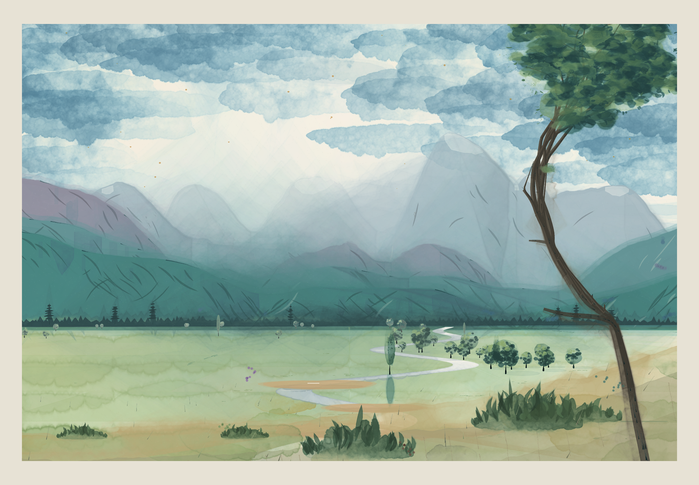

# 037 — Watercolor Landscape v1

**Mechanism (one sentence):** the scene engine of
[036 — Oil Landscape v1](../036-aerial-recession/) (one camera, one ground plane, one low
sun, one transmittance term `1 − e^(−k·z)`) is repainted by a watercolourist: light to dark,
far to near, transparent washes and glazes over a white sheet, with the paper as the only
white.

Original composition, painted with [p5.brush](https://github.com/acamposuribe/p5.brush)
(2.2.3, p5 2.x WEBGL). It is not a copy of any painting.

## v4: after Albrecht Dürer's *View of Trento* (c. 1495)

The reference is an early watercolour heightened with bodycolour. Each technique in it was
analysed and adapted. The town and the boat are subject matter, not technique, so they were
left out, and the composition stays the engine's own. The result is a seventh mood,
**Dürer valley**, which is now the default, with the alpine valley as the default scene.

| # | Technique in the reference | v3 | v4 implementation (`paint6`) |
|---|---|---|---|
| 1 | The sky is mostly bare warm paper. Blue-grey is scumbled in level, half-dry passes that thicken toward the top and the corners (a vignette); there are no cut-out clouds. | saturated blue sky, white paper clouds | `wcSkyDurer`: a pale warm wash, then up to 44 wet, granulating, irregular patches. Their density follows `skyVignette` (height × distance from the centre), so the middle low sky stays paper. Clouds are soft grey drifts with pale tops. |
| 2 | Mountains in strong local colour, nearly bodycolour: teal and blue-green near, one rose-violet range, pale blue far, misting out on one side | translucent blue-grey glazes | palette per range, with the middle range mixed 50 % toward violet (`durerRangeTint`). Every range but the farthest gets a second dense layer over its wash. |
| 3 | The mountains are modelled by thin strokes running down the gullies | shadow-plane glazes only | `wcStriations`: up to 150 strokes per near range along each slope's fall line (`rangePlane`). They gather in the shade, with a lighter one now and then on a lit rib. |
| 4 | Round trees, dark blue-green, built of small stippled dabs with lighter tops | pines and broad touches | no pines in this mood; `wcStipple` dabs each crown, dark low and away from the light, lighter on top |
| 5 | A broad, still, pale grey-blue river with soft vertical reflections and a few level lights | broken horizontal Homer strokes | `wcWaterDurer`: an even grey-blue wash, feathered vertical reflections, and faint level lights |
| 6 | Flat ochre sandbars and a sandy foreground with soft edges | none | up to three sandbars in the river (one wet), and a sandy bank (`SAND`) |
| 7 | Meadows as light yellow-green and ochre patches, with no tufts | grass masses | the plain is meadow drops only; the bank keeps five green masses, with rigger grass cut to 35 % |
| 8 | A limited palette: teal, ochre/sand, warm cream, a violet accent, grey-blue | summer greens | the mood palette (`MOODS['Dürer valley']`) |
| 9 | Old paper: an uneven warm tone and foxing spots | clean sheet | `wcAgedSheet` (one wet warm tone and four soft patches) and `wcFoxing` (26 small brown spots in the sky) |
| 10 | No pencil lay-in shows | pencil at 0.2 | the lay-in is skipped in this mood |

Defaults changed:
- mood: Dürer valley
- scene: alpine valley
- atmosphere: 0.5
- foreground trees: 1

The other six moods are unchanged and can be picked from the panel, summer day among
them. Known gap: the shared engine fixes the river's width, so the valley's river is
narrower than Dürer's. The **fjord / lake** scene gives the broad still water instead.

## v2: after Winslow Homer's *The Blue Boat* (1892)

The reference was compared with the v1 painting. The gaps were technical, not about
subject, so each one was traced to a method and the method was implemented. The
composition stays original: no boat or figures, and the same engine-built landscape.

| Homer's method | v1 | v2 implementation |
|---|---|---|
| A saturated blue sky; the cumulus are the **white of the paper**, with only their flat-bottomed grey bellies painted | a grey sky, with the clouds painted grey over it | a new mood, **summer day** (the default). The sky is laid as deep wet bands. Each cloud is lifted back to paper lobe by lobe, and its belly is a flat-bottomed wet grey band found along its base (`inCloud`), darkest at the base. A few tapered level strokes give the sky its banding. |
| A full range of values: near-black conifers, white paper | everything mid-value and pastel | pigment load 1.25; a dark band of spruce with spired tops along the foot of the hills, and a few tall spires with tiers of branches |
| Calligraphic pines: a thin trunk, tiers of horizontal dabs, sky between them | round blots | `wcPine`: tiers of drooping horizontal touches, lit tops dropped in, gaps of sky. On a summer day a third of the plain's trees are pines. |
| The foliage of the near trees as masses of loaded-brush touches | transparent round glazes | each crown clump is a few broad drooping touches: light on the sunward top, dark beneath, mid between. Only the 10 largest masses get a wet underwash, so the sky shows through. |
| Vegetation built up wet: variegated greens, rust and ochre, darks massed at the foot | pale banded green | wet drops of green, rust and ochre, then 60 masses on the plain and 16 on the bank. Each is a dark body whose top breaks into upright tips, with upright strokes over its edge (`vegMass`). |
| Water in level strokes: the sky's blue deeper than the sky, streaks of white paper, the banks' dark mirrored and pulled out across it | a grey band | by day the land's washes are taken back off the river, which is tinted and then written in broken horizontal strokes, with dark bank reflections from each edge inward (`wcWaterStrips`) |
| No gimmicks | pen hatching, salt and a pencil lay-in on by default | the pen is off by default; salt, spatter and pencil are reduced |

The other five moods keep their painted, coloured clouds: lifted white clouds are wrong
under a low sun, a storm light or the moon. The water and vegetation methods apply to every
daylight mood.

Changed defaults:
- mood: summer day
- sun: 0.7
- atmosphere: 0.6
- clouds: 0.75
- mist: 0.25
- wetness: 0.45
- pigment load: 1.25
- granulation: 0.4
- backruns: 0.65
- lifting: 0.4
- horizon band: 0.4
- pencil: 0.2
- pen: 0
- spatter: 0.25
- salt: 0.1

## v3: loose edges in the vegetation and foliage

In v2 the foliage and vegetation were drawn as flat `wash` glazes. A `wash` cuts a hard,
even edge, so masses read as cut-outs. Wet watercolour spreads past where it is laid and
thins there. v3 builds that into the glazes and spends more of the wet-fill budget on the
greenery.

| Change | Method |
|---|---|
| **Feathered glaze** (`wsoft`) | Every soft mark is laid three times: a faint spread 16 % beyond the shape (22 % of the strength), the shape itself (42 %), and a denser core 12 % inside (50 %). Each outline is jittered on its own, so the edge fades and wanders. The amount of spread is set per use. |
| Crown underwashes | The 22 largest crown clumps (v2: 10) get a bleeding wet fill left to spread outward (bleed 0.45–0.65), and the rest a feathered glaze. The light and mid touches are soft (spread 1.2); the dark touches are firmer (0.85), as if dropped in once the light had settled. The touches are smoother (twice the outline points). |
| Vegetation masses | Each body is wet and spreads at its top into the wash behind it. Up to 28 masses on the plain and 12 on the bank get a real bleeding fill (v2: 12 in total); the rest are feathered. 70 % of the upright tips melt into the body and 30 % stay crisp, like a dry pass. |
| Pines and sword leaves | Branch tiers and leaves are feathered. |

Cost: 214 fills for seed 4 (v2: 186), and the render time in the test container rose about
11 % (362 s against 327 s at 1240×860).

## What is shared, what is new

| Layer | Source | Notes |
|---|---|---|
| Scene engine: projection, aerial perspective, moods, viewpoints, scene types, ranges and peaks, river, fields, trees, framing trees, clouds | 036, extracted unchanged (36 functions) | the same seed gives the same landscape in both projects |
| Painter | new (`wc*` functions) | every pass is a watercolour operation; no oil pass is reused |
| Panel, seeds, presets, shuffle (`X`), Apply button | 036 pattern | the parameters are watercolour-specific |

## The constraint that shaped the painter (measured, not assumed)

The library's renderer was benchmarked in this repository before the painter was tuned:

| Finding (p5.brush 2.2.3) | Measurement | Consequence |
|---|---|---|
| Strokes are opaque marks. `opacity` and a colour's alpha only soften the edge, and strokes of one colour do not build up where they cross. | Brushes tested at opacity 10–30, with `#rrggbbaa` and with `color(r,g,b,a)`: all render as solid lines | Strokes are kept for the **opaque media**: pencil, rigger, pen, white gouache, spatter, salt and sponge. |
| `fill` (with `fillBleed` and `fillTexture`) is the real watercolour: wet edges, bleeding and pigment gathered at the rim | about 1–2 s per fill in software GL (this repository's test container); far less on a GPU | Fills are kept for the **wet** passes, with a budget. |
| `wash` is a transparent flat glaze that builds up where glazes overlap | about 0.2 ms per wash | Glazes laid on dry paper, and every small mark, use `wash`. |
| Thin solid lines read darker than their nominal colour | visual check | Rigger and pen colours are mixed toward the paper. |

The first draft ignored this. It painted 3,016 fills and 2,385 strokes; washes read as black
bars and a render took over 15 minutes. The current painter's counts (measured):

| Painting (v3) | Fills | Washes | Strokes (`wline`/`wstroke`) |
|---|---|---|---|
| v4 default: seed 4, Dürer valley, alpine valley | 208 | 10,511 | 217 |
| v4: seed 4, Dürer valley, fjord / lake | 177 | 7,757 | 261 |
| v4: seed 4, summer day, river plain (one framing tree) | 213 | 11,187 | 263 |
| seed 4, summer day (default) | 214 | 14,090 | 366 |
| seed 4, golden hour | 246 | 19,640 | 422 |
| seed 4, moonlit night | 225 | 13,043 | 373 |
| seed 4, late snow | 203 | 1,396 | 342 |
| seed 11, fjord / lake (summer day) | 191 | 18,806 | 334 |

Grass `flowLine`s, pencil and pen splines, sponge, spatter and granulation come on top of
the strokes counted here. A painting takes 4.5–6 minutes at 1240×860 in the software-GL
test container, and much less in a desktop browser with a GPU.

## Painting order (light to dark, far to near)

1. **Paper and underdrawing.** A 2H graphite lay-in (`spline` with `wiggle`): the crests,
   the river's banks, where the trees stand, and the framing trunk.
2. **Sky, wet into wet.** Five level bands overlap by half, top to bottom (a graded wash;
   `fillBleed` run level, angle 0). The light is lifted round the sun, and warm and cool
   variegated drops go into the wet.
3. **Clouds.** Each cloud gets one pale wash of its whole mass, made from the union of its
   lobes (`unionPoly`), and one shadow wash that dries with a backrun rim. The lining is
   lifted toward the sun, and a warm glaze runs along the base at a low sun. Cirrus is dry
   brush.
4. **Mountains**, far to near. Each range is one body wash; far ranges are pale, flat and
   soft, near ones deeper and granulating. Then:
   - one or two drops into the wet;
   - the **shadow planes**, found column by column and joined into a few shapes, each one
     glaze with a hard edge;
   - the summits' shadow faces, glazed one to three times;
   - rock in dry brush down the fall line;
   - snow restated in white gouache as shapes, found the same way as the shadows, blue on
     the shadow side, with the lower edge broken by touches of the brush;
   - the crest lost and found in rigger runs;
   - valley mist lifted at the foot;
   - one lifted horizon band.
5. **The plain.** Five level bands from far colour to near, then the far woods as one dark band
   with crowns, which hides where the nearest range's wash stops. Fields are glazed (wet
   near, flat far). Hedges and the plain's texture are dry brush. Cloud shadows are soft
   glazes, and grass is rigger strokes drawn through the wind field (`flowLine`).
   - In late snow, the furrows are broken white-gouache slivers converging on the horizon,
     with dry-brushed earth between them.
   - At night, the whole land is glazed down once more.
6. **Water.** The river is washed in the sky's reflected colour. A lake is reserved: the
   ranges stop at its far shore, and the plain's bands and fields are laid round it
   (`lakeRows`, `bandOutsideLake`), as a watercolourist paints round a light. On a lake, each range hangs
   upside down from the far shore as a light glaze, its foot dragged into streaks and
   clipped at the near shore, with wind lines lifted across it. The trees are mirrored, and dry-brush skips and gouache glints
   catch the light.
7. **Trees on the plain.** The near crowns are wet blots and the far ones single glazes,
   with a dark side, a rigger trunk, sponge on the lit side and a cast-shadow glaze. At
   night, lit windows.
8. **Foreground bank.** One dark wet wash with drops of olive, earth and blue, and a second
   glaze lower down. The lower bank is massed with graphite (`mass` + `massArray`). Grass is
   flicked through a fresh gust (`refreshField`); sword leaves are single swelling
   brush-shaped glazes; flowers are touches.
9. **Framing trees.** The trunk and big limbs are washed and the rest glazed, with the shadow
   side glazed over and bark marked with the rigger.
   - Each crown mass is one light wash (wet for the 10 largest), with mid clumps on the
     shadow side and dark drop-ins.
   - Sponge dabs go on light and dark sides, and leaf-touches of the brush's tip and dry
     brush break the outer edge.
   - In late snow the trees are bare.
10. **Pen and finish.**
    - Sepia pen (`hatchStyle`) hatches the near summits' shadow faces in one pass
      (`hatchArray`), plus a few clumps in the bank. The nearest crest and the trunk are
      contoured with the hand's wobble.
    - Spatter and salt are added.
    - Granulation dots go into the mountains, and the paper's tooth into the whole sheet.

## p5.brush features: where each is used

| Feature | Used for |
|---|---|
| `fill`, `fillBleed(strength, dir, angle)`, `fillTexture(tex, border, scatter)` | every wet wash: sky bands run level (angle 0), drips down the ranges (angle π/2), hard-edged glazes (`dir: 'in'`, high border), soft lifts |
| `wash` | glazes on dry paper, field glazes, reflections, clumps of leaves, dry-brush hairs, sword leaves, gouache glints and stars |
| `brush.add`: `custom` tips with `gaussian` pressure and `rotate: 'natural'` | `wc-round`, `wc-flat` (gouache), `sponge` (a tip of dots), `salt` (a star) |
| `brush.add`: `default` and `spray` types | `rigger` (a tapering sable), `spatter`, `granule` |
| `addField`, `field`, `flowLine`, `refreshField` | the `wind` field: grass on the plain and on the bank (the bank gets a later gust) |
| `wiggle` | the pencil lay-in, the crest runs, the pen contours |
| `spline`, `line`, `beginStroke` / `move` / `endStroke` | the pencil and pen, rigger crests, twigs as single continuous strokes |
| `hatch`, `hatchStyle`, `hatchArray` | pen and wash: all the summits' faces hatched as one pass |
| `mass`, `massArray` | graphite massing of the lower bank (two bands of the bank handed over as `brush.Polygon`s) |
| `brush.Polygon` | the polygons handed to `hatchArray` and `massArray` |
| `polygon`, `rect` (through `bpoly`) | every fill and wash shape |
| `scaleBrushes`, `load` | brush size follows the canvas; the buffers are rebuilt on resize |

The rest of the README list was left out deliberately:
- `clip` and `noClip` are no-ops in 2.2.3.
- `image` brushes would need external tip files; the tips are drawn in code instead.
- `Plot` and `Position` are used indirectly: `beginStroke` builds a `Plot`.

## Controls

| Group | Parameter (default) | Effect |
|---|---|---|
| Scene | scene, viewpoint, mood (golden hour, after the storm, dawn mist, moonlit night, late snow, summer day, **Dürer valley**, the default); scene default: alpine valley, sun, atmosphere, ranges, mountain forms, mist, clouds, cloud rows, river meander, trees, framing trees, foreground trees, stand, tree rhymes the peak | as in 036 (the same engine) |
| Watercolour · washes | paper (cold pressed) | rough granulates more and breaks dry brush more; hot pressed hardly granulates |
| | wetness (0.45) | how far the washes bleed |
| | pigment load (1.25) | opacity of every wash |
| | granulation (0.4) | `fillTexture` grain and granulating dots |
| | backruns / hard edges (0.65) | pigment gathered at a wash's rim (`fillTexture` border) |
| | glazes over dry paint (2) | glazes on the summits' shadow faces |
| | variegated drops (0.6) | wet-in-wet drops in the sky, ranges and bank |
| | lifted lights (0.4) | lifted sun, cloud linings, mist |
| | lifted horizon band (0.4) | the bright band over the skyline |
| Watercolour · techniques | graphite underdrawing (0.2) | the pencil lay-in |
| | dry brush (0.6) | cirrus, hedges, the plain's texture, rock, water light |
| | shadow planes (0.7) | the planes on the mountains |
| | sponge (0.6) | foliage texture |
| | rigger (0.7) | grass and twigs |
| | massing (0.5) | the bank's graphite massing |
| | pen and wash (0, off) | the sepia pen |
| | spatter (0.25), salt (0.1) | texture |
| | white gouache (0.6) | snow, stars, glints |
| | hand wobble (2) | the lines' wobble |
| | cloud shadows (0.7), flowers (0.5) | as named |
| Mountains / Night | snow, couloirs, rock, valley mist, cloud shadows on mountains / stars, moon size, window lights | as in 036 |

The **Apply changes** button repaints: a painting takes a while, so sliders do not
re-render on their own. The status line shows the stage being painted.

Keys and other controls:
- `X` shuffles everything, with guards on sun, atmosphere, load and pen.
- `R` makes a new scene and `P` a new hand: the paint seed changes every brush jitter and
  leaves the scene as it is.
- `S` saves a PNG.
- Presets save and load as `.json`. ★ restores the tuned seed 4.

## Lessons carried over from 036

- The scene is computed once; painting is a queue of small tasks under a 28 ms frame budget,
  so the page stays responsive and shows progress.
- The settings are frozen when a painting starts (`wcParams`), so a slider moved
  mid-painting changes nothing that is already queued.
- Light comes from one place. Every lit edge, cast shadow, lining and glint is computed from
  the sun's position, and nothing is lit by taste.
- Aerial perspective is applied to colour, contrast, edge hardness and detail density alike.
  Far washes are paler, flatter, softer-edged and simpler.
- The foreground belongs to the painting. It is painted in the same medium and order as the
  rest, not pasted on top.
